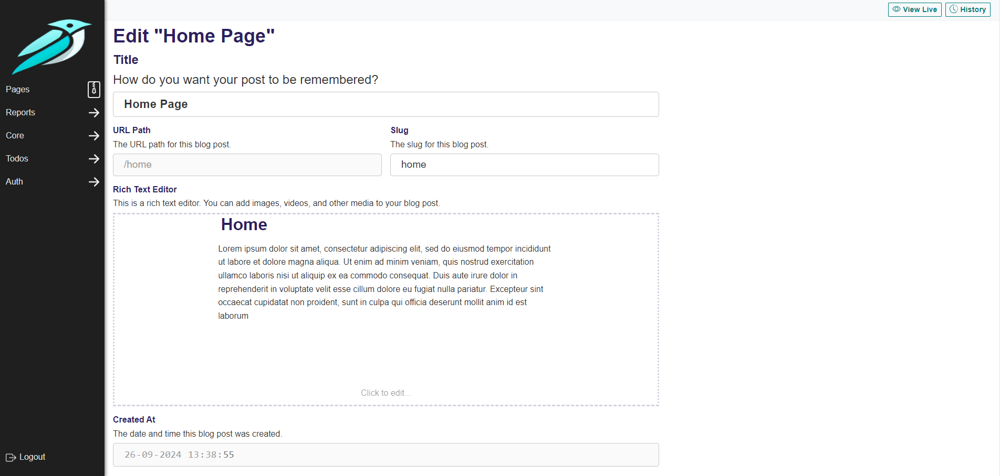

# go-django (v2)



**Django** rewritten to **Golang**.

This is a rewrite of the Django framework in Golang.

The goal is to provide a similar experience to Django, but with the performance of Golang.

At the core this is meant to be a web framework, but it also includes sub-packages to create a CMS-like experience.

There is a caveat though; we try to touch the database as little as possible.

This means that we don't have a full ORM like Django does.

Any database logic should be implemented by the end-developer, but some sub-packages do provide backends to use with MySQL and SQLite. Postgres is not planned yet.

Latest version: `v1.6.6.3`

## Installation

The package is easily installed with `go get`.

```bash
go get github.com/Nigel2392/go-django@v1.6.6.3
```

The [CLI](./docs/cli.md) can optionally be installed with `go install`.

This will provide some useful utilities to help you get started, like creating a new project, app or Dockerfile.

```bash
go install github.com/Nigel2392/go-django/cmd/go-django@v1.6.6.3
```

## Docs

- [Using the CLI](./docs/cli.md)
- [Configuring your server](./docs/configuring.md)
- [Creating an app](./docs/apps.md)
- [Creating Forms](./docs/forms/forms.md) (WIP)
  - [Working with Fields](./docs/forms/fields.md)
  - [Working with Widgets](./docs/forms/widgets.md)
  - [Passing and creating Media](./docs/forms/media.md)
- [Defining your models](./docs/attrs.md)
- [Working with permissions](./docs/permissions.md)
- [Setting up Routing](./docs/routing.md)
- [Creating Management Commands](./docs/commands.md)
- [Working with context](./docs/context.md)
- [Rendering Your Templates](./docs/rendering.md)
- [Usage of Contenttypes](./docs/contenttypes.md)
- [Paginating your data](./docs/pagination.md)
- [Easily rendering Views](./docs/views.md) (WIP)
- [Setting up and calling Hooks](./docs/hooks.md)
- [Working with the Filesystem](./docs/filesystem.md)
- [Serving your Staticfiles](./docs/staticfiles.md)
- [Cache Management](./docs/cache.md)
- [Caching your Views](./docs/caching_views.md)
- [Sending Emails](./docs/mail.md)
- [Setting up Logging](./docs/logging.md)

### Contrib apps

- [sessions](./docs/apps/sessions.md)
- [admin](./docs/apps/admin) (WIP)
- [auditlogs](./docs/apps/auditlogs.md) (WIP)
- [auth](./docs/apps/auth) (WIP)
- [pages](./docs/apps/pages) (WIP)
- [editorjs](./docs/apps/editor.md) (WIP)

### Examples

- [Todo App](./docs/examples/todos.md)

## Help Needed

- [ ] Block application:
  - [ ] Javascript for structblock
  - [ ] Javascript for listblock
  - [ ] (maybe) Javascript for fieldblock
